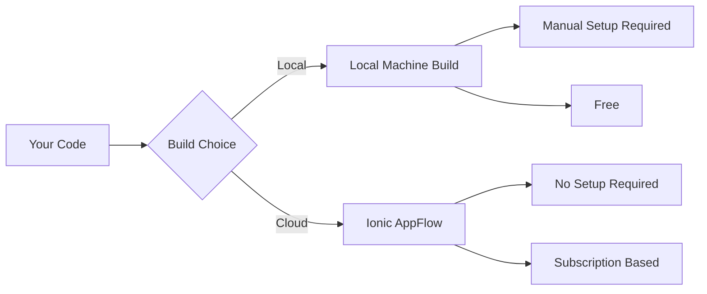
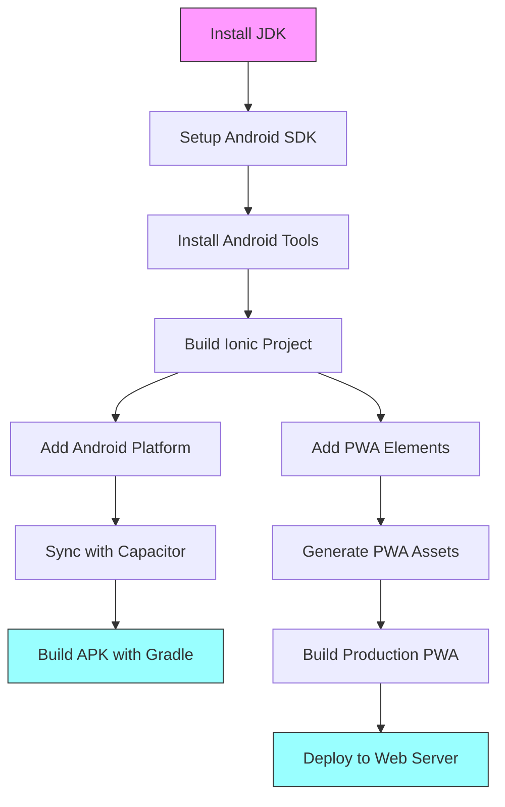

# Lab: Building APK Apps from an Ionic App

## Introduction
In this lab, you will learn how to set up your development environment and build an APK from an Ionic app step by step.

### Project Creation and Setup

1. Create new Ionic project:
   ```bash
   # Create new Ionic Angular project
   ionic start device-info-app blank --type=angular

   # Select Standalone
   
   # Navigate to project directory
   cd device-info-app
   ```

3. Install Capacitor Plugins:
   ```bash
   npm install @ionic/pwa-elements @capacitor/device
   ```

   Each plugin provides a consistent interface to different platform capabilities:
   - @capacitor/device: Used to retrieve device information
  
Create a new device-info service :
```bash
ionic g s services/device-info
```

### Device Service Implementation

```typescript
// src/app/services/device-info.service.ts
import { Injectable } from '@angular/core';
import { Device } from '@capacitor/device';

@Injectable({
  providedIn: 'root'
})
export class DeviceInfoService {
  constructor() { }

  async getDeviceInfo() {
    try {
      // In browser, uses various navigator properties
      const info = await Device.getInfo();
      return info;
    } catch (error) {
      console.error('Error getting device info:', error);
      throw error;
    }
  }
}
```
Create a button on the home page template to active the `getDeviceInfo()` method above.

```html
<ion-button class="ion-margin" (click)="getDeviceInfo()">Get Device Info</ion-button>

@if (deviceInfo) {
<ion-card class="ion-margin">
 <ion-card-header>
   <ion-card-title>Device Information</ion-card-title>
 </ion-card-header>
 <ion-card-content>
   <p><strong>Model:</strong> {{deviceInfo.model}}</p>
   <p><strong>Platform:</strong> {{deviceInfo.platform}}</p>
   <p><strong>Operating System:</strong> {{deviceInfo.operatingSystem}}</p>
   <p><strong>OS Version:</strong> {{deviceInfo.osVersion}}</p>
   <p><strong>Manufacturer:</strong> {{deviceInfo.manufacturer}}</p>
 </ion-card-content>
</ion-card>
}
```

### What's Really Happening in the Browser
1. Device.getInfo() collects information from:
   - navigator.userAgent
   - navigator.platform
   - window.innerWidth/Height
   - Other browser APIs

## Part 1: Environment Setup

### Step 1: Install Java Development Kit
First, we need to install Java 17, which is required for Android development:
```bash
sudo apt-get update
sudo apt-get install -y openjdk-17-jdk
```

Set up the JAVA_HOME environment variable:
```bash
export JAVA_HOME=$(readlink -f /usr/bin/java | sed "s:/bin/java::")
echo "export JAVA_HOME=$JAVA_HOME" >> ~/.bashrc
echo "export PATH=\$PATH:\$JAVA_HOME/bin" >> ~/.bashrc
```

### Step 2: Set Up Android SDK
1. Create a directory for the Android SDK:
```bash
mkdir -p ~/android-sdk
cd ~/android-sdk
```

2. Download and set up Android command-line tools:
```bash
# Download command line tools
wget https://dl.google.com/android/repository/commandlinetools-linux-9477386_latest.zip

# Create final directory structure
mkdir -p cmdline-tools/latest

# Extract directly to correct location
unzip commandlinetools-linux-9477386_latest.zip
mv cmdline-tools/* cmdline-tools/latest/
rm -rf cmdline-tools/latest/cmdline-tools 2>/dev/null || true

# Clean up
rm commandlinetools-linux-9477386_latest.zip

# Verify correct structure
ls -la cmdline-tools/latest
```

3. Configure Android SDK environment variables:
```bash
export ANDROID_SDK_ROOT=~/android-sdk
echo "export ANDROID_SDK_ROOT=~/android-sdk" >> ~/.bashrc
echo "export PATH=\$PATH:\$ANDROID_SDK_ROOT/cmdline-tools/latest/bin" >> ~/.bashrc
echo "export PATH=\$PATH:\$ANDROID_SDK_ROOT/platform-tools" >> ~/.bashrc
```

4. Accept licenses and install required Android packages:
```bash
source ~/.bashrc
yes | sdkmanager --licenses
sdkmanager "platform-tools" "platforms;android-33" "build-tools;33.0.0"
```

## Part 2: Building the APK

### Step 1: Create and Build Ionic Project
1. Build your Ionic project:
```bash
cd /workspaces/w11-lab-building-apps-*/device-info-app/
ionic build --prod
```

2. Add Android platform support:
```bash
ionic capacitor add android
```

3. Sync your project with Capacitor:
```bash
ionic capacitor sync android
```

### Step 2: Build the APK
1. Navigate to the Android project directory:
```bash
cd android
```

2. Make the Gradle wrapper executable:
```bash
chmod +x gradlew
```

3. Build the debug APK:
```bash
./gradlew assembleDebug
```

Your APK will be created at: `android/app/build/outputs/apk/debug/app-debug.apk`

4. Append the following to the end of your .gitignore file
```bash
# Android (ignore entire build directory but keep config files)
/android/*
!/android/capacitor.config.json
!/android/app/src/
!/android/build.gradle
!/android/gradle.properties
```
5. Transfer the apk file to your Android device and install it

## Part 3: Building and Deploying a PWA

### Step 1: Add PWA Elements
First, add PWA elements to your Ionic project:
```bash
npm install @ionic/pwa-elements
```

Add the following to your `src/main.ts`:
```typescript
import { defineCustomElements } from '@ionic/pwa-elements/loader';
defineCustomElements(window);
```

### Step 2: Generate PWA Assets
Generate icons and splash screens for your PWA:
```bash
ionic capacitor resources
```

### Step 3: Build the PWA
Build your project with the production flag:
```bash
ionic build --prod
```

### Step 4: Test the PWA Locally
Install a local HTTP server if you haven't already:
```bash
npm install -g http-server
```

Serve your PWA:
```bash
cd www
http-server -p 8080
```

Visit `http://localhost:8080` in your browser. To test PWA features:
1. Open Chrome DevTools (F12)
2. Go to Application tab
3. Look for the "Service Workers" section

## Part 4: Building APK with Ionic AppFlow

### Step 1: Set Up Ionic AppFlow
1. Create an Ionic account at [dashboard.ionicframework.com](https://dashboard.ionicframework.com)
2. Install Ionic CLI with AppFlow capabilities:
```bash
npm install -g @ionic/cli@latest
```

### Step 2: Connect Your App
1. Initialize AppFlow in your project:
```bash
ionic link
```
2. Follow the prompts to:
   - Create a new app in AppFlow
   - Connect to your existing git repository

### Step 3: Configure Build Settings
1. Go to your app dashboard on AppFlow
2. Navigate to `Deploy > Builds`
3. Click "New Build"
4. Select following settings:
   - Platform: Android
   - Build Type: Debug/Release
   - Environment: Production
   - Build Stack: Latest

### Step 4: Initiate the Build
1. Click "Start Build"
2. AppFlow will:
   - Clone your repository
   - Install dependencies
   - Build the APK
   - Provide download link

## AppFlow vs Local Building


### Advantages of AppFlow
- No local environment setup needed
- Consistent build environment
- Build for iOS without a Mac
- Automated builds on git push
- Built-in signing key management

### Cost Considerations
- Free tier: Limited builds/month
- Paid tiers: 
  - More builds
  - Concurrent builds
  - Extra features

## Updated Process Flow


## Testing PWA Features
- Test offline functionality by disabling network in DevTools
- Try "Add to Home Screen" on a mobile device
- Verify push notifications if implemented

## Common Issues and Solutions
1. If JAVA_HOME is not set, rerun: `source ~/.bashrc`
2. If Android SDK tools aren't found, verify your PATH settings
3. For permission issues, ensure you use sudo for apt commands

## Conclusion
You've learned how to manually set up your environment and build an Android APK from your Ionic app. These steps help you understand the build process and troubleshoot issues when they arise.
